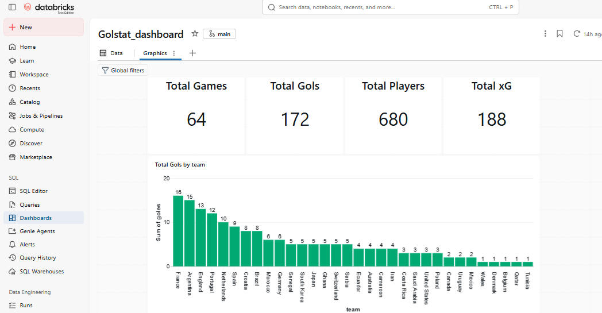

# GolStats — Football Data Engineering & Analytics Pipeline

End-to-end football data engineering and analytics pipeline built with **Databricks Free Edition**, using **PySpark, Spark SQL, Delta Lake, Unity Catalog, MLlib, and Databricks AI/BI Dashboards**.

The project processes **StatsBomb Open Data** for the **2022 FIFA World Cup**, following a Medallion Architecture (Bronze → Silver → Gold), extended with an analytical data model, a BI dashboard, and two Machine Learning components (player clustering and goal prediction).

The pipeline was initially developed and validated using a controlled subset of 10 matches and subsequently scaled to the complete competition dataset of **64 matches and 234,637 events**.

> See the complete architecture and layer descriptions in [`docs/architecture.md`](docs/architecture.md).

---

## Project Overview

GolStats is designed as an end-to-end data engineering project that transforms raw football event data into analytical datasets suitable for business intelligence and machine learning use cases.

The current pipeline follows this flow:

```text
StatsBomb Open Data
        │
        ▼
    Ingestion
        │
        ▼
   Raw JSON Files
        │
        ▼
      Bronze
        │
        ▼
      Silver
        │
        ▼
       Gold
        │
        ▼
 Data Quality Gate
        │
        ▼
  Analytical Data Model
        │
   ┌────┴────┐
   ▼         ▼
Dashboard    ML
          ┌──┴───┐
          ▼      ▼
    Clustering  Prediction
```

---

## Current Status

The following components have been implemented and validated:

* StatsBomb Open Data ingestion.
* Raw JSON storage in a Unity Catalog Volume.
* Bronze layer using Delta Lake.
* Silver layer with flattened and standardized event data.
* Gold layer with match, team, and player analytics.
* Tournament-level player aggregation.
* Incremental scaling from 10 development matches to all 64 World Cup matches.
* Structural validation across Bronze, Silver, and Gold.
* Duplicate and grain validation.
* Cross-layer reconciliation of official match scores against event-derived goals.
* Handling of own goals and penalty shootout events according to their analytical meaning.
* Star-schema analytical data model (fact and dimension tables) with referential integrity validation.
* Databricks AI/BI Dashboard with KPI, team performance, and player leaderboard visuals.
* Player profile clustering using K-Means.
* Goal prediction model comparing Linear Regression and Poisson Regression.

### Planned

Future development will extend the existing project with:

* Automated pipeline execution using Databricks Workflows.
* Player position as a feature, to resolve the clustering limitation described below.
* Additional feature engineering for the prediction model.

---

## Dataset

The current dataset represents the complete **2022 FIFA World Cup**:

| Metric                  |   Value |
| ----------------------- | ------: |
| Matches                 |      64 |
| Events                  | 234,637 |
| Teams                   |      32 |
| Player-match records    |   1,996 |
| Tournament players      |     680 |
| Official match goals    |     172 |
| Player-attributed goals |     169 |

The difference between official match goals and player-attributed goals is intentional.

Three `Own Goal For` events do not contain a player attribution and are therefore included in team-level goals but not assigned to individual players.

Penalty shootout goals are also excluded from match/player performance statistics because they are not regular match goals.

---

## Medallion Architecture

### Bronze

The Bronze layer preserves the raw event structure received from StatsBomb while adding basic metadata for data lineage.

Table:

```text
golstats.bronze.eventos_statsbomb
```

Grain:

```text
One row = one StatsBomb event
```

### Silver

The Silver layer transforms the nested StatsBomb event structure into a standardized analytical event model.

Key transformations include:

* Flattening nested fields.
* Standardizing column names.
* Extracting team and player information.
* Extracting event coordinates.
* Extracting pass attributes.
* Extracting shot attributes.
* Normalizing pass outcomes.
* Preserving event-level granularity.

Table:

```text
golstats.silver.eventos
```

Grain:

```text
One row = one StatsBomb event
```

### Gold

The Gold layer contains analytical datasets designed for downstream consumption.

| Table                                | Grain                                     | Records |
| ------------------------------------- | ------------------------------------------ | ------: |
| `golstats.gold.partidos`              | One row per match                          |      64 |
| `golstats.gold.estadisticas_equipo`   | One row per team-match                     |     128 |
| `golstats.gold.estadisticas_jugador`  | One row per player-match                   |   1,996 |
| `golstats.gold.player_tournament`     | One row per tournament player              |     680 |
| `golstats.gold.dim_equipo`            | One row per team (dimension)               |      32 |
| `golstats.gold.dim_jugador`           | One row per player (dimension)             |     680 |
| `golstats.gold.player_clusters`       | One row per player, with cluster label     |    ~460 |
| `golstats.gold.goal_predictions`      | One row per player, with predicted goals   | test split |

---

## Data Quality & Validation

Data quality is treated as a validation gate between data engineering and downstream analytics.

The project includes validations for:

### Structural integrity

* Expected number of matches.
* Unique match identifiers.
* Total event counts.
* Unique event identifiers.
* Expected number of teams per match.

### Analytical grain

* One row per match in Match Gold.
* One row per team-match in Team Gold.
* One row per player-match in Player Gold.
* One row per player in Tournament Player Gold.
* Duplicate detection.

### Metric reconciliation

Event-derived metrics are reconciled against aggregated Gold datasets.

Examples include:

* Passes.
* Shots.
* Goals.
* xG.
* Pressures.
* Ball recoveries.
* Dispossessions.

### Match score reconciliation

Official match scores from StatsBomb competition metadata were compared against goals independently calculated from event-level data.

The reconciliation produced:

```text
64 matches checked
0 score discrepancies
```

This provides an independent cross-layer validation between official match metadata and event-derived analytical metrics.

---

## Scaling Strategy

The pipeline was intentionally developed using a controlled dataset of 10 matches.

This allowed the transformation logic and analytical definitions to be validated before increasing the data volume.

The pipeline was then scaled to the complete competition without changing the underlying Medallion Architecture.

```text
Development
10 matches
    │
    ▼
Validation
    │
    ▼
Production-scale dataset
64 matches
234,637 events
```

The scaling process also uses incremental raw ingestion:

* Existing event files are detected.
* Only missing matches are downloaded.
* Raw files follow a consistent naming convention.
* The complete dataset is then rebuilt through Bronze → Silver → Gold.

---

## Analytical Data Model

Before connecting the Gold layer to a BI tool, the tables were organized into a star schema to avoid ambiguous or many-to-many relationships.

**Fact tables:**

* `partidos` — match context (one row per match).
* `estadisticas_equipo` — team performance (one row per team-match).
* `estadisticas_jugador` — player performance (one row per player-match).
* `player_tournament` — tournament-level player aggregate. Kept **standalone**, not related to the match-level facts, since mixing per-match and per-tournament grains in the same visual would double-count metrics.

**Dimension tables:**

* `dim_equipo` — one row per team, built from the distinct team names in `estadisticas_equipo`.
* `dim_jugador` — one row per player, built from `player_tournament`.

**Relationships:**

```text
dim_equipo ──< estadisticas_equipo >── partidos (via match_id)
dim_jugador ──< estadisticas_jugador
```

`dim_equipo` is intentionally **not** related directly to `partidos`, since `partidos` has two team columns (`home_team`, `away_team`) — a direct relationship would create ambiguity about which one to filter on. Filtering by team flows through `estadisticas_equipo` instead.

**Referential integrity was validated with anti-joins:**

```text
Home teams without a match in dim_equipo: 0
Away teams without a match in dim_equipo: 0
Players without a match in dim_jugador:   0
```

---

## Dashboard

A Databricks **AI/BI Dashboard** was built directly on the Gold and dimension tables (no external BI tool required, keeping the entire project self-contained within Databricks Free Edition).



**Sections:**

* **KPIs** — total matches, goals, xG, and players in the tournament.
* **Team performance** — goals by team, and a goals-vs-xG scatter plot highlighting over/under-performing teams relative to their expected goals.
* **Player leaderboards** — top goalscorers and top pass creators of the tournament, sourced from `player_tournament`.

The dashboard definition is exported to [`dashboards/golstats_dashboard.lvdash.json`](dashboards/golstats_dashboard.lvdash.json) for reproducibility, since AI/BI dashboards are not natively tracked by Databricks Git folders.

---

## Machine Learning

Two ML components were built on top of `player_tournament`, both intentionally scoped to be explainable rather than to maximize accuracy.

### Player Profile Clustering

**Goal:** group players into style-based profiles using unsupervised learning, without predefined labels.

**Approach:**

* Filtered to players with `matches_played >= 3` to reduce noise from low-minute players.
* Engineered per-match rate features (goals, xG, shots, passes, pressures, recoveries per match, plus pass completion %) to avoid bias toward players who played more matches.
* Standardized features and ran **K-Means** with `k = 4`.
* Labeled clusters based on their average statistical profile.

**Resulting profiles:**

| Cluster | Players | Profile | Example players |
|---|---|---|---|
| Finisher | 62 | Highest goals, xG, and shots | Messi, Mbappé, Lewandowski |
| High-volume engine | 125 | Most passes, pressures, and recoveries | Kimmich, Modrić, De Bruyne |
| Clean possession, low defensive engagement | 126 | High pass accuracy, low volume | — |
| Low involvement | 96 | Lowest values across most metrics | — |

**Validation:** Silhouette score = **0.271** (moderate — consistent with a known limitation, see below).

**Limitation:** the "Low involvement" cluster mixes two structurally different groups — genuinely low-minute players and **goalkeepers**, whose event profile (few shots, passes, and pressures in open play) looks statistically similar to a bench player even though their role is completely different. This happens because player position is not available as a feature. A future improvement would add position and either exclude goalkeepers from this clustering or model them separately.

Result persisted to `golstats.gold.player_clusters`.

### Goal Prediction

**Goal:** predict a player's total tournament goals from underlying volume and quality metrics (xG, shots, passes, pressures, ball recoveries, matches played).

Two models were compared, since goals are sparse count data (most players score 0), which violates the assumptions behind ordinary Linear Regression:

| Model | RMSE | R² |
|---|---|---|
| Linear Regression | 0.541 | -0.054 |
| **Poisson Regression** | **0.496** | **0.115** |

Poisson regression — designed for count data — outperformed Linear Regression on both metrics. The R² remains modest, which is expected: individual goal-scoring outcomes have a large random component (a deflected shot, a favorable matchup) that a small set of underlying stats cannot fully capture from a single tournament. The model does capture directional signal — for example, both Nikola Vlašić and Randal Kolo Muani received high predicted values due to strong shot/xG volume, even though only one of them actually scored.

This result is presented honestly as a modest but methodologically appropriate model, rather than an overstated one. Result persisted to `golstats.gold.goal_predictions`.

---

## Technical Stack

| Technology                      | Purpose                                              |
| -------------------------------- | ----------------------------------------------------- |
| **Databricks Free Edition**      | Development and execution environment                 |
| **PySpark**                      | Distributed data transformations                      |
| **Spark SQL**                    | Data exploration and validation                       |
| **Delta Lake**                   | Transactional table storage                            |
| **Unity Catalog**                | Data governance and organization                       |
| **PySpark MLlib**                | Clustering (K-Means) and regression (Linear / Poisson) |
| **Databricks AI/BI Dashboards**  | BI visualization, built natively on Gold tables        |
| **Python**                       | Ingestion and supporting logic                         |
| **StatsBomb Open Data**          | Football event data                                    |
| **Git / GitHub**                 | Version control and project documentation              |

---

## Unity Catalog Structure

The project uses the following catalog structure:

```text
golstats
│
├── bronze
│   └── eventos_statsbomb
│
├── silver
│   └── eventos
│
└── gold
    ├── partidos
    ├── estadisticas_equipo
    ├── estadisticas_jugador
    ├── player_tournament
    ├── dim_equipo
    ├── dim_jugador
    ├── player_clusters
    └── goal_predictions
```

Raw JSON files are stored separately in a Unity Catalog Volume:

```text
/Volumes/golstats/bronze/raw_files
```

---

## Repository Structure

```text
GolStats/
│
├── README.md
│
├── notebooks/
│   ├── 00_ingestion_statsbomb.py
│   ├── 01_bronze_events.py
│   ├── 02_silver_events.py
│   ├── 03_gold_analytics.py
│   ├── 04_scale_pipeline.py
│   ├── 05_powerbi_preparation.py
│   └── 06_ml.py
│
├── dashboards/
│   └── golstats_dashboard.lvdash.json
│
├── docs/
│   ├── architecture.md
│   └── dashboard_screenshot.png
│
└── .gitignore
```

The notebooks are stored in **Databricks source format** (`.py`) 

This allows them to be imported back into a Databricks workspace and executed as notebooks.

---

## Data Source

The football event data comes from **StatsBomb Open Data**:

https://github.com/statsbomb/open-data

The raw event JSON files are **not versioned in this repository**.

They are downloaded automatically by the ingestion notebook and stored in the Databricks Unity Catalog Volume.

This keeps the Git repository focused on:

* Source code.
* Data transformations.
* Analytical logic.
* Validation logic.
* Documentation.

---

## Reproducibility

To reproduce the project:

1. Create a Databricks Free Edition workspace.
2. Create the `golstats` catalog.
3. Create the `bronze`, `silver`, and `gold` schemas.
4. Create a Volume for raw event files.
5. Import the notebooks from the `notebooks/` directory.
6. Execute the notebooks in order:

```text
00 → 01 → 02 → 03 → 04 → 05 → 06
```

The ingestion notebook downloads the required StatsBomb event data.

Notebooks 01–04 transform and validate the data through the Medallion Architecture.

Notebook 05 builds the star-schema data model (dimension tables and referential integrity checks).

Notebook 06 builds the Machine Learning components (clustering and goal prediction).

7. Recreate the dashboard in Databricks using the exported definition in `dashboards/golstats_dashboard.lvdash.json`, or rebuild it manually against the Gold and dimension tables.

---

## Roadmap

```text
[x] StatsBomb ingestion
[x] Bronze layer
[x] Silver layer
[x] Gold layer
[x] Scale to complete World Cup
[x] Data quality validation
[x] Star-schema analytical data model
[x] Databricks AI/BI Dashboard
[x] Player profile clustering
[x] Goal prediction model
[ ] Databricks Workflows automation
[ ] Player position as a modeling feature
```

---

## Project Objective

The main objective of GolStats is to demonstrate an end-to-end **data engineering and analytics workflow** using a realistic analytical dataset.

The project focuses on:

* Data ingestion.
* Distributed transformations.
* Medallion Architecture.
* Data modeling.
* Analytical aggregations.
* Data quality.
* Cross-layer reconciliation.
* Scalability.
* Reproducibility.
* BI dashboarding.
* Machine Learning (clustering and predictive modeling).
* Honest reporting of model limitations.

The project will continue evolving as new analytical and machine learning components are added.